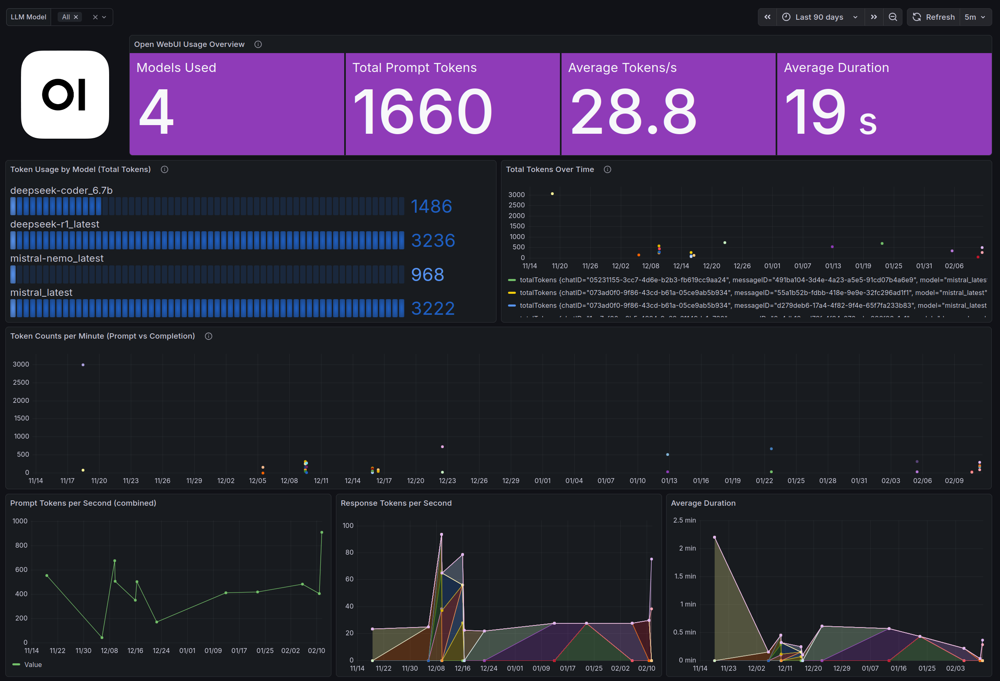

Grafana Dashboard for Open WebUI
===================

This project consists of a Bash Shell script to retrieve the  Open WebUI information, directly from the RESTfulAPI, about chats, messages and their stats. The information is being saved to an InfluxDB database. Finally, a Grafana dashboard can be created to present all of the information.

We use Open WebUI RESTfulAPI to reduce the workload and increase the speed of script execution. 

#### Screenshot of the Grafana dashboard version 2


#### Screenshot of the Grafana dashboard version 1


----------

## Local development

Copy the .env.example as .env
```bash
cp .env.example .env
```

Edit the values in the .env file. Some configuration options to note are:
* SCRAPE_INTERVAL_SECONDS: To control the frequency to request new stats from the Open WebUI host.
* DRY_RUN:  Set to true to run the scraper program without writing anything to the InfluxDB.

Run docker compose
```bash
docker compose up -d
```

## Tests

### Verify the setup

The InfluxDB service should respond:
```bash
curl -i http://localhost:8086/health
```

You should be able to login to InfluxDB:
http://localhost:8086/

### InfluxDB write test

Run test to verify write access to the InfluxDB:
```bash
chmod +x tests/ci_influx_verify.sh
```

Start InfluxDB, load .env vars and run the test script:
```bash
docker compose up -d influxdb

set -a
source .env
set +a

export INFLUX_URL="http://localhost:8086"

bash tests/ci_influx_verify.sh
```

Shutdown:
```bash
docker compose down -v
```


## Deployments (to production)

### Setup

Here we use a docker compose deployment approach.

Check server compatibility:
```bash
docker --version
docker compose version
```

Create a dedicated directory:
```bash
sudo mkdir -p /opt/openwebui-scraper
sudo chown -R $USER:$USER /opt/openwebui-scraper
cd /opt/openwebui-scraper
git clone https://github.com/alfredeen/openwebui-grafana-bash.git .
```

Pull the code from the main branch:
```bash
git pull --ff-only
```

Create a .env file and edit as needed, at least the change-me values.
```bash
cp .env.example .env
chmod 600 .env
```

Build and start it:
```bash
docker compose up -d --build
docker compose ps |grep influx
docker compose ps |grep scraper
docker compose logs -f scraper
```

NB: Login to the InfluxDB and change the admin password via the InfluxDB UI. The INFLUXDB_INIT_PASSWORD is used only on first startup when the database is initialized. Changing INFLUXDB_INIT_PASSWORD later has no effect unless the InfluxDB volume is deleted.

Verify the deployment:
```bash
curl -fsS http://localhost:8086/health
docker compose logs --since=10m scraper
docker volume ls | grep scraper_state
```

### Stopping the scraper service

```bash
docker compose stop scraper
```
(Never stop it using -v)

### Upgrades and modifying settings

Note that the scaper service logic relies on a timestamp read from and written to a lastrun.txt file.
This is also created in dry_only=true mode.
To reset the scraper service to read all history, then delete this file and restart the service:
```bash
docker exec -it openwebui-scraper rm -f /state/lastrun.txt
docker compose up -d --force-recreate scraper
```

If modifying the .env settings, redeploy the scraper service:
```bash
cd /opt/openwebui-scraper
docker compose up -d --force-recreate scraper
docker compose logs -f scraper
```


## Grafana dashboard

In Grafana, create a new dashboard from the JSON content in the file /grafana/grafana_dashboard_open_webui_2.json


## Source attribution and history

This repository is originally based on https://github.com/jorgedlcruz/openwebui-grafana, now maintained independently.
